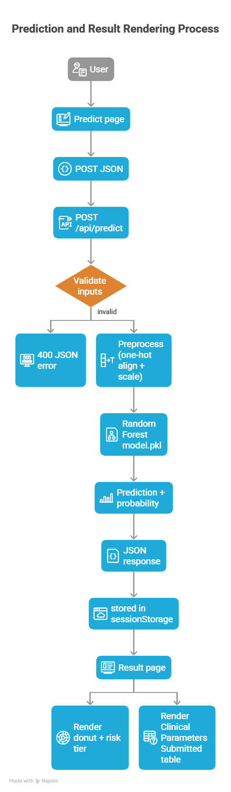

# HeartGuard — Heart Disease Prediction (Flask + ML)

HeartGuard is a production-style Flask web app that predicts heart disease risk from clinical inputs using a trained **RandomForestClassifier (Gini)**. It includes a clean web UI, a JSON API, model comparison charts, and EDA visualizations.

> Disclaimer: This project is for educational and informational purposes only and is **not** a medical device.

## Highlights

- **Fast inference**: model + scaler loaded once at startup
- **Web UI**: multi-page Bootstrap UI (Home, Predict, Result, Models, Visualizations)
- **REST API**: `POST /api/predict` and validation endpoints
- **Input validation**: realistic bounds and categorical checks
- **No persistence**: inputs are processed in-memory (no database)

## App Flow (Flowchart)



## Tech Stack

- **Backend**: Flask
- **ML**: scikit-learn (RandomForestClassifier, MinMaxScaler)
- **Frontend**: Bootstrap 5, Bootstrap Icons
- **Charts**: Chart.js
- **Artifacts**: `joblib` (`model.pkl`, `scaler.pkl`, `feature_info.pkl`)

## Repository Layout

```text
.
├─ app.py
├─ train_model.py
├─ heart_statlog_cleveland_hungary_final.csv
├─ model.pkl
├─ scaler.pkl
├─ feature_info.pkl
├─ templates/
├─ static/
└─ utils/
```

## Quickstart (Windows)

### 1) Create + activate a venv

```powershell
python -m venv .venv
& .\.venv\Scripts\Activate.ps1
```

### 2) Install dependencies

This repo works with `pip` or `uv`.

```powershell
python -m pip install -r requirements.txt
```

Or with uv:

```powershell
uv pip install -r requirements.txt
```

### 3) (Optional) Train/re-train the model

```powershell
python train_model.py
```

### 4) Run the app

```powershell
python app.py
```

Open: http://localhost:5000

## Pages

- `/` — Home
- `/predict` — Prediction form
- `/result` — Result report
- `/comparison` — Model comparison
- `/visualizations` — EDA charts

## API

### POST `/api/predict`

**Request**

```json
{
	"age": 54,
	"sex": "male",
	"chest_pain_type": "typical_angina",
	"cholesterol": 230,
	"fasting_blood_sugar": 0,
	"rest_ecg": "normal",
	"max_heart_rate_achieved": 150,
	"exercise_induced_angina": 0,
	"st_depression": 1.2,
	"st_slope": "upsloping"
}
```

**Response (example)**

```json
{
	"success": true,
	"prediction": "Heart Disease",
	"probability": 0.87,
	"risk_level": "High Risk",
	"risk_color": "#dc2626",
	"confidence": "87.0%",
	"input_data": {
		"age": 54,
		"sex": "male",
		"chest_pain_type": "typical_angina",
		"cholesterol": 230,
		"fasting_blood_sugar": 0,
		"rest_ecg": "normal",
		"max_heart_rate_achieved": 150,
		"exercise_induced_angina": 0,
		"st_depression": 1.2,
		"st_slope": "upsloping"
	}
}
```

### POST `/api/validate`

Validates payload shape/ranges without predicting.

### GET `/api/model-info`

Returns model metadata and feature lists.

## Input Validation (Summary)

- **Age**: 1–120
- **Cholesterol**: 0–600
- **Fasting blood sugar**: 0 or 1
- **Max heart rate**: 60–220
- **Exercise induced angina**: 0 or 1
- **ST depression (Oldpeak)**: 0–10
- **Categories**: `sex`, `chest_pain_type`, `rest_ecg`, `st_slope`

## Model Details

- **Algorithm**: Random Forest
- **Criterion**: **Gini** (`criterion='gini'` in `train_model.py`)
- **Estimators**: 100

## Troubleshooting

### "InconsistentVersionWarning" from scikit-learn

This warning appears when loading a model artifact created with a different scikit-learn version.

Options:

- Re-train the model in your current environment: `python train_model.py`
- Or pin scikit-learn to the artifact’s version (not recommended unless you control deployment end-to-end)

### App won’t start with `python app.py`

Make sure you’re using the venv interpreter:

```powershell
c:/Users/admin/Desktop/Projects/ml/.venv/Scripts/python.exe app.py
```

## License

MIT (or update this section to your preferred license).

